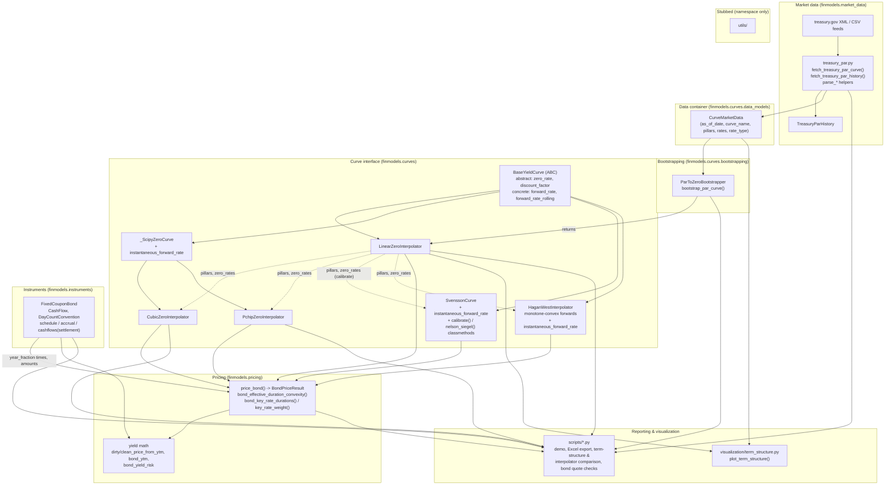

# Architecture

`finmodels` is a lean curve-construction and pricing library. Data flows in one
direction: raw market quotes are ingested, bootstrapped into a zero curve,
wrapped in an interpolator implementing a common interface, and then consumed by
valuation, reporting, and visualization code.

> Keep this file in sync with the code by running `/update-architecture`.

## Diagram

## Layers

### 1. Market data — `finmodels.market_data`
`treasury_par.py` fetches the US Treasury CMT **par yield** curve from
home.treasury.gov: the XML feed (`fetch_treasury_par_curve` -> a single
`CurveMarketData`) and the daily-rates CSV (`fetch_treasury_par_history` ->
`TreasuryParHistory`, one year of rows in percentage points). Parsing is split
into `parse_treasury_par_curve` / `parse_treasury_par_history` helpers so tests
run offline against fixtures. Failures raise `TreasuryFetchError`.

### 2. Data container — `finmodels.curves.data_models`
`CurveMarketData` is a validated dataclass: `pillars` (years, strictly
ascending, positive) aligned with `rates` (decimals), plus `as_of_date`,
`curve_name`, `rate_type` (default `"PAR_YIELD"`). It is the single hand-off
type between ingestion and construction.

### 3. Bootstrapping — `finmodels.curves.bootstrapping`
`ParToZeroBootstrapper` strips par yields to zero rates: short tenors
(`t <= short_end_cutoff`, default 1.0y) as single-cashflow instruments, longer
tenors via a closed-form sequential recursion on a dense semi-annual coupon
grid. `bootstrap_par_curve()` is the one-call wrapper. Output is a
`LinearZeroInterpolator` over the dense grid whose discount factors reprice the
input par bonds exactly.

### 4. Curve interface — `finmodels.curves`
`BaseYieldCurve` (ABC) defines the contract: concrete curves implement
`zero_rate` and `discount_factor`; the base supplies `forward_rate` and the
vectorized `forward_rate_rolling` (continuous / simple / semi-annual), derived
purely from discount factors. `finmodels.curves.__init__` re-exports
`BaseYieldCurve`, the five curves, `CurveMarketData`, `ParToZeroBootstrapper`,
and `bootstrap_par_curve`.

| Curve | Backing | Notes |
|---|---|---|
| `LinearZeroInterpolator` | `numpy.interp` | flat extrapolation; what the bootstrapper returns |
| `CubicZeroInterpolator` | `scipy CubicSpline` (`bc_type="natural"`) | C2; `self.spline`; can overshoot |
| `PchipZeroInterpolator` | `scipy PchipInterpolator` | C1, shape-preserving; `self.pchip` |
| `SvenssonCurve` | 6-parameter NSS formula | not an interpolator — a smooth parametric fit |
| `HaganWestInterpolator` | monotone-convex forward construction (Hagan-West 2006) | pillar-exact; smooth non-negative forwards, closed-form DF integration |

The two spline curves share `_ScipyZeroCurve`, which adds
`instantaneous_forward_rate(t) = z(t) + t·z'(t)` from the spline's analytical
derivative. They are typically constructed from the bootstrapped zero rates
sampled at the market pillars.

`HaganWestInterpolator(pillars, zero_rates | discount_factors=...)` builds the
Hagan-West (2006) monotone-convex forward curve: it strips discrete forwards,
blends knot instantaneous forwards, collars them non-negative, and fits a
per-interval quadratic/spliced `g(x)` with `INT_0^1 g = 0` (so every pillar
reprices exactly). Discount factors come from closed-form integration of the
piecewise-polynomial forward. Removes the linear-interpolation forward "shark
fin" without spline overshoot.

`SvenssonCurve(beta0..beta3, tau1, tau2)` is the Nelson-Siegel-Svensson model:
`zero_rate`, `discount_factor`, and a closed-form `instantaneous_forward_rate`.
`SvenssonCurve.calibrate(pillars, zero_rates)` least-squares-fits the six
parameters inside economic box bounds (`beta0 in [1%, 15%]`, bounded
slope/curvature loadings, separated decay terms) plus a penalty keeping
`z(0) = beta0 + beta1 >= 0`, with a short multi-start over the decay terms — the
"calibrator" arm of the pipeline, parallel to the bootstrapper.
`SvenssonCurve.nelson_siegel(...)` is the 4-parameter special case.

### 5. Instruments — `finmodels.instruments`
`bond.py` is curve-independent calendar math. `FixedCouponBond` owns
backward-rolled semi-annual schedules (End-of-Month aware), day-count
conventions (`DayCountConvention`: `ACT/ACT_ICMA`, `30/360_US`), accrued
interest, and the settlement-relative discounting times. `cashflows(settlement)`
returns a list of `CashFlow` records — each carrying `year_fraction` (the
discounting time `t_i` a pricing layer feeds to a `BaseYieldCurve`),
`accrual_factor`, `coupon`, `principal`, `amount`. Scope is US Treasury
notes/bonds: regular schedules only, no stub periods. `__init__` re-exports
`CashFlow`, `DayCountConvention`, `FixedCouponBond`.

### 6. Pricing — `finmodels.pricing`
`bond.py` values a `FixedCouponBond`, taking cashflow times/amounts from the
instrument and discount factors from any `BaseYieldCurve`.

* **Pure yield math** (semi-annual / `m = frequency` compounding on the bond's
  own `year_fraction` times): `dirty_price_from_ytm`, `clean_price_from_ytm`,
  `bond_ytm` (Newton-Raphson with an analytic derivative, `scipy.optimize.brentq`
  fallback over `[-0.10, 1.00]`), `bond_yield_risk` -> `(macaulay_duration,
  modified_duration, dv01, convexity)`.
* **Curve pricing**: `price_bond(bond, curve, settlement)` discounts the
  cashflows on the curve and back-solves the implied yield, returning
  `BondPriceResult` (clean/dirty price, accrued, ytm, durations, dv01,
  convexity). `bond_effective_duration_convexity` measures a symmetric parallel
  bump of the semi-annually compounded zero curve.
  `bond_key_rate_durations` (with `DEFAULT_KRD_PILLARS` and the tent-weight
  helper `key_rate_weight`) bumps each pillar's zero rate by a tent-weighted
  `z2` shift; because the weights partition unity the KRDs sum to the effective
  duration.

`finmodels.pricing.__init__` re-exports `BondPriceResult`, `price_bond`,
`dirty_price_from_ytm`, `clean_price_from_ytm`, `bond_ytm`,
`bond_effective_duration_convexity`, `bond_key_rate_durations`,
`DEFAULT_KRD_PILLARS`.

### 7. Reporting & visualization
`visualization/term_structure.py::plot_term_structure` takes a `CurveMarketData`
plus any `BaseYieldCurve` and renders par / zero / rolling-forward panels.
`scripts/` holds executable reports: `demo_treasury_curve.py` (live-data demo),
`export_curve_to_excel.py` (formula-driven Excel export),
`term_structure_report.py` (term-structure chart), `compare_interpolators.py` /
`compare_curves.py` (Linear vs Cubic vs PCHIP / cross-model comparison),
`inspect_bond.py`, `verify_real_bonds.py`, `verify_market_quotes.py` (bond
clean-price / yield checks against vendor quotes).

### 8. Stubbed
`utils/` exists as an empty package — a namespace placeholder with no
implementation yet.

## Test suites (`tests/`)

| File | Covers | Network |
|---|---|---|
| `test_treasury_par.py` | XML + CSV parsing against fixtures; mocked fetches; wrapped errors | 2 live tests (`@pytest.mark.network`) |
| `test_bootstrapping.py` | flat-curve invariance, par-bond repricing, slope properties, validation | offline |
| `test_interpolation.py` | linear interpolation, extrapolation, `forward_rate` / `forward_rate_rolling`, `BaseYieldCurve` conformance | offline |
| `test_splines.py` | both spline curves (parametrized): pillar interpolation, analytical forward, smoother-than-linear check | offline |
| `test_parametric.py` | `SvenssonCurve`: closed-form checks, limits, analytical vs finite-difference forward, calibration round-trip | offline |
| `test_monotone_convex.py` | `HaganWestInterpolator`: pillar invariance (1e-10), per-interval integral repricing via `scipy.integrate.quad` (1e-7), flat-curve, positivity on 1000-pt grid, no-shark-fin | offline |
| `test_bond_instrument.py` | `FixedCouponBond`: EOM schedule roll, ACT/ACT_ICMA + 30/360_US accrual, `coupon_period`, `cashflows` year-fractions | offline |
| `test_bond_pricing.py` | yield math (price<->ytm round-trip, Newton/brentq), duration/dv01/convexity, `price_bond` on curves, effective & key-rate durations | offline |
| `test_visualization.py` | `plot_term_structure` figure structure and file output (Agg backend) | offline |

Run `pytest -m "not network"` for the fast offline suite.
