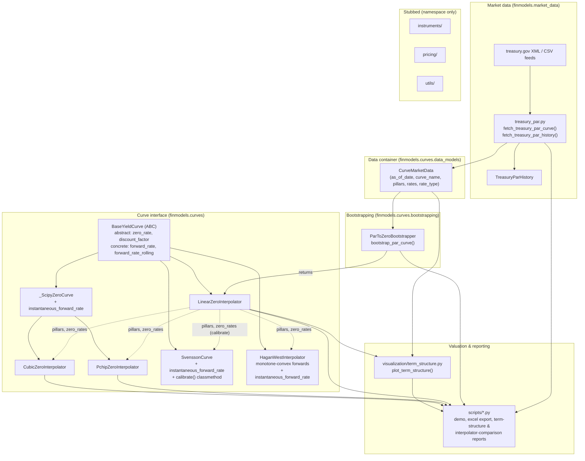

# Architecture

`finmodels` is a lean curve-construction and pricing library. Data flows in one
direction: raw market quotes are ingested, bootstrapped into a zero curve,
wrapped in an interpolator implementing a common interface, and then consumed by
valuation, reporting, and visualization code.

> Keep this file in sync with the code by running `/update-architecture`.

## Diagram

## Layers

### 1. Market data — `finmodels.market_data`
`treasury_par.py` fetches the US Treasury CMT **par yield** curve from
home.treasury.gov: the XML feed (`fetch_treasury_par_curve` -> a single
`CurveMarketData`) and the daily-rates CSV (`fetch_treasury_par_history` ->
`TreasuryParHistory`, one year of rows in percentage points). Parsing is split
into `parse_*` helpers so tests run offline against fixtures. Failures raise
`TreasuryFetchError`.

### 2. Data container — `finmodels.curves.data_models`
`CurveMarketData` is a validated dataclass: `pillars` (years, strictly
ascending, positive) aligned with `rates` (decimals), plus `as_of_date`,
`curve_name`, `rate_type` (default `"PAR_YIELD"`). It is the single hand-off
type between ingestion and construction.

### 3. Bootstrapping — `finmodels.curves.bootstrapping`
`ParToZeroBootstrapper` strips par yields to zero rates: short tenors
(`t <= short_end_cutoff`, default 1.0y) as single-cashflow instruments, longer
tenors via a closed-form sequential recursion on a dense semi-annual coupon
grid. `bootstrap_par_curve()` is the one-call wrapper. Output is a
`LinearZeroInterpolator` over the dense grid whose discount factors reprice the
input par bonds exactly.

### 4. Curve interface — `finmodels.curves`
`BaseYieldCurve` (ABC) defines the contract: concrete curves implement
`zero_rate` and `discount_factor`; the base supplies `forward_rate` and the
vectorized `forward_rate_rolling` (continuous / simple / semi-annual), derived
purely from discount factors. `finmodels.curves.__init__` re-exports
`BaseYieldCurve`, the three interpolators, `CurveMarketData`,
`ParToZeroBootstrapper`, and `bootstrap_par_curve`.

| Curve | Backing | Notes |
|---|---|---|
| `LinearZeroInterpolator` | `numpy.interp` | flat extrapolation; what the bootstrapper returns |
| `CubicZeroInterpolator` | `scipy CubicSpline` (`bc_type="natural"`) | C2; `self.spline`; can overshoot |
| `PchipZeroInterpolator` | `scipy PchipInterpolator` | C1, shape-preserving; `self.pchip` |
| `SvenssonCurve` | 6-parameter NSS formula | not an interpolator — a smooth parametric fit |
| `HaganWestInterpolator` | monotone-convex forward construction (Hagan-West 2006) | pillar-exact; smooth non-negative forwards, closed-form DF integration |

The two spline curves share `_ScipyZeroCurve`, which adds
`instantaneous_forward_rate(t) = z(t) + t·z'(t)` from the spline's analytical
derivative. They are typically constructed from the bootstrapped zero rates
sampled at the market pillars.

`HaganWestInterpolator(pillars, zero_rates | discount_factors=...)` builds the
Hagan-West (2006) monotone-convex forward curve: it strips discrete forwards,
blends knot instantaneous forwards, collars them non-negative, and fits a
per-interval quadratic/spliced `g(x)` with `INT_0^1 g = 0` (so every pillar
reprices exactly). Discount factors come from closed-form integration of the
piecewise-polynomial forward. Removes the linear-interpolation forward "shark
fin" without spline overshoot.

`SvenssonCurve(beta0..beta3, tau1, tau2)` is the Nelson-Siegel-Svensson model:
`zero_rate`, `discount_factor`, and a closed-form `instantaneous_forward_rate`.
`SvenssonCurve.calibrate(pillars, zero_rates)` least-squares-fits the six
parameters inside economic box bounds (`beta0 in [1%, 15%]`, bounded
slope/curvature loadings, separated decay terms) plus a penalty keeping
`z(0) = beta0 + beta1 >= 0`, with a short multi-start over the decay terms — the
"calibrator" arm of the pipeline, parallel to the bootstrapper.
`SvenssonCurve.nelson_siegel(...)` is the 4-parameter special case.

### 5. Valuation, reporting & visualization
`visualization/term_structure.py::plot_term_structure` takes a `CurveMarketData`
plus any `BaseYieldCurve` and renders par / zero / rolling-forward panels.
`scripts/` holds executable reports (live-data demo, formula-driven Excel export,
term-structure chart, Linear vs Cubic vs PCHIP comparison).

### 6. Stubbed
`instruments/`, `pricing/`, and `utils/` exist as empty packages — namespace
placeholders with no implementation yet.

## Test suites (`tests/`)

| File | Covers | Network |
|---|---|---|
| `test_treasury_par.py` | XML + CSV parsing against fixtures; mocked fetches; wrapped errors | 2 live tests (`@pytest.mark.network`) |
| `test_bootstrapping.py` | flat-curve invariance, par-bond repricing, slope properties, validation | offline |
| `test_interpolation.py` | linear interpolation, extrapolation, `forward_rate` / `forward_rate_rolling`, `BaseYieldCurve` conformance | offline |
| `test_splines.py` | both spline curves (parametrized): pillar interpolation, analytical forward, smoother-than-linear check | offline |
| `test_parametric.py` | `SvenssonCurve`: closed-form checks, limits, analytical vs finite-difference forward, calibration round-trip | offline |
| `test_monotone_convex.py` | `HaganWestInterpolator`: pillar invariance (1e-10), per-interval integral repricing via `scipy.integrate.quad` (1e-7), flat-curve, positivity on 1000-pt grid, no-shark-fin | offline |
| `test_visualization.py` | `plot_term_structure` figure structure and file output (Agg backend) | offline |

Run `pytest -m "not network"` for the fast offline suite.

